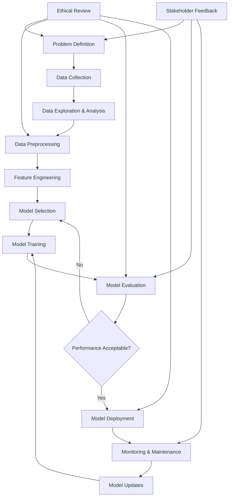

# AI-Powered POS System for Horizon Enterprise
## Understanding the AI Development Workflow Assignment

**Course:** AI for Software Engineering  
**Duration:** 7 days  
**Total Points:** 100  
**Student:** [Your Name]  
**Date:** November 8, 2025

---

## Table of Contents
1. [Part 1: Short Answer Questions (30 points)](#part-1)
2. [Part 2: Case Study Application (40 points)](#part-2)
3. [Part 3: Critical Thinking (20 points)](#part-3)
4. [Part 4: Reflection & Workflow Diagram (10 points)](#part-4)
5. [References](#references)

---

## Part 1: Short Answer Questions (30 points) {#part-1}

### 1. Problem Definition (6 points)

**Hypothetical AI Problem:** "AI-Powered Point of Sale (POS) System for Horizon Enterprise - Predicting Customer Purchase Behavior and Optimizing Inventory Management"

**Three Objectives:**
1. **Sales Prediction:** Predict future sales patterns based on historical data, seasonal trends, and customer behavior to optimize inventory levels
2. **Customer Segmentation:** Automatically categorize customers based on purchasing patterns to enable personalized marketing and recommendations
3. **Fraud Detection:** Identify potentially fraudulent transactions in real-time to minimize financial losses

**Two Stakeholders:**
1. **Store Managers:** Need accurate inventory predictions and customer insights to make informed business decisions
2. **Customers:** Benefit from personalized recommendations, faster checkout processes, and improved product availability

**Key Performance Indicator (KPI):**
- **Inventory Turnover Accuracy:** Measure the percentage improvement in inventory turnover rate and reduction in stockouts/overstock situations (Target: 25% improvement in inventory efficiency)

### 2. Data Collection & Preprocessing (8 points)

**Two Data Sources:**
1. **Transaction Database:** Historical sales data including product IDs, quantities, prices, timestamps, customer information, and payment methods
2. **External Market Data:** Weather data, local events, economic indicators, and competitor pricing information from APIs and web scraping

**One Potential Bias:**
**Seasonal Bias:** Historical sales data may be heavily skewed toward certain seasons (e.g., holiday shopping), leading to poor predictions during off-peak periods or for new seasonal products without historical context.

**Three Preprocessing Steps:**
1. **Missing Data Handling:** Use forward-fill for missing price data and mean imputation for missing customer demographic information
2. **Normalization:** Apply Min-Max scaling to numerical features like prices and quantities to ensure all features contribute equally to model training
3. **Feature Engineering:** Create new features such as "days_since_last_purchase," "average_basket_size," and "purchase_frequency" to capture customer behavior patterns

### 3. Model Development (8 points)

**Chosen Model:** **Random Forest Ensemble**

**Justification:** Random Forest is ideal for this POS system because:
- Handles both numerical and categorical features effectively
- Provides feature importance rankings to understand key sales drivers
- Resistant to overfitting with multiple decision trees
- Performs well with mixed data types common in retail environments
- Offers good interpretability for business stakeholders

**Data Splitting Strategy:**
- **Training Set (70%):** Used to train the model on historical transaction patterns
- **Validation Set (20%):** Used for hyperparameter tuning and model selection
- **Test Set (10%):** Used for final unbiased performance evaluation
- **Time-based split:** Ensure temporal order is maintained (train on older data, test on recent data)

**Two Hyperparameters to Tune:**
1. **n_estimators (number of trees):** Controls model complexity and performance; too few may underfit, too many may overfit and increase computation time
2. **max_depth:** Limits tree depth to prevent overfitting while maintaining enough complexity to capture important patterns in customer behavior

### 4. Evaluation & Deployment (8 points)

**Two Evaluation Metrics:**
1. **Mean Absolute Percentage Error (MAPE):** Measures prediction accuracy as a percentage, making it interpretable for business stakeholders (e.g., "sales predictions are within 5% of actual values")
2. **F1-Score for Fraud Detection:** Balances precision and recall for the critical fraud detection component, ensuring both false positives and false negatives are minimized

**Concept Drift:** The phenomenon where the statistical properties of target variables change over time, making models less accurate. In retail, this could occur due to:
- Changing customer preferences
- New product introductions
- Economic conditions affecting purchasing power
- Seasonal pattern shifts

**Monitoring Strategy:** Implement automated monitoring comparing prediction accuracy against actual results weekly, with alerts when performance drops below 90% of baseline accuracy.

**One Technical Deployment Challenge:**
**Real-time Processing Scalability:** The POS system must handle hundreds of simultaneous transactions while providing instant recommendations and fraud detection. Solution involves implementing distributed computing with load balancers and caching frequently accessed predictions.

---

## Part 2: Case Study Application (40 points) {#part-2}

### Scenario: Hospital AI System for Patient Readmission Risk Prediction

### Problem Scope (5 points)

**Problem Definition:** Develop an AI system to predict the probability of patient readmission within 30 days of discharge to enable proactive intervention and improve patient outcomes while reducing healthcare costs.

**Objectives:**
1. Achieve 85% accuracy in predicting 30-day readmission risk
2. Reduce actual readmission rates by 20% through early intervention
3. Optimize resource allocation for post-discharge care programs

**Stakeholders:**
- **Primary:** Physicians, nurses, discharge planners, hospital administrators
- **Secondary:** Patients, families, insurance providers, regulatory bodies

### Data Strategy (10 points)

**Proposed Data Sources:**
1. **Electronic Health Records (EHRs):** Patient demographics, medical history, diagnoses (ICD-10 codes), procedures, medications, vital signs, lab results
2. **Administrative Data:** Length of stay, discharge disposition, insurance information, previous admissions, emergency department visits
3. **Social Determinants:** ZIP code-based socioeconomic data, transportation access, home support systems

**Two Ethical Concerns:**
1. **Patient Privacy (HIPAA Compliance):** Risk of exposing sensitive medical information through model predictions or data breaches
2. **Algorithmic Bias:** Potential discrimination against certain demographic groups (race, age, socioeconomic status) leading to unequal care quality

**Preprocessing Pipeline:**
```
Raw EHR Data → Data Validation → Missing Value Imputation → 
Feature Encoding → Normalization → Feature Selection → 
Bias Detection → Final Dataset
```

**Feature Engineering Steps:**
- Convert ICD-10 codes to categorical features
- Calculate Charlson Comorbidity Index
- Create "frequent_flyer" indicator for patients with >3 admissions/year
- Derive medication complexity scores
- Aggregate lab values into risk categories

### Model Development (10 points)

**Selected Model:** **Gradient Boosting Machine (XGBoost)**

**Justification:**
- Excellent performance with structured healthcare data
- Handles missing values naturally
- Provides feature importance for clinical interpretability
- Robust to outliers common in medical data
- Supports probability outputs for risk stratification

**Hypothetical Confusion Matrix:**
```
                Predicted
Actual     No Readmit  Readmit
No Readmit     850      100     (Specificity: 89.5%)
Readmit         75      175     (Sensitivity: 70.0%)

Precision = 175/(175+100) = 63.6%
Recall = 175/(175+75) = 70.0%
```

**Analysis:** Model shows good specificity but moderate sensitivity, suggesting room for improvement in identifying high-risk patients.

### Deployment (10 points)

**Integration Steps:**
1. **API Development:** Create RESTful API endpoints for real-time risk scoring
2. **EHR Integration:** Embed risk scores directly into existing EHR workflows
3. **Alert System:** Implement automated alerts for high-risk patients (>70% probability)
4. **Dashboard Creation:** Develop clinician-facing dashboard for risk monitoring
5. **Training Program:** Conduct staff training on interpreting and acting on predictions

**HIPAA Compliance Measures:**
- Implement end-to-end encryption for all data transmission
- Use de-identification protocols for model training datasets
- Establish audit logs for all system access and predictions
- Create data use agreements with clear purpose limitations
- Regular security assessments and penetration testing

### Optimization (5 points)

**Addressing Overfitting Method:** **Cross-Validation with Early Stopping**
- Implement 5-fold stratified cross-validation during training
- Use early stopping to halt training when validation performance plateaus
- Apply regularization parameters (L1/L2) to penalize model complexity
- Monitor learning curves to detect overfitting patterns

---

## Part 3: Critical Thinking (20 points) {#part-3}

### Ethics & Bias (10 points)

**Impact of Biased Training Data on Patient Outcomes:**

Biased training data in healthcare AI can have severe consequences:

1. **Demographic Disparities:** If training data under-represents certain ethnic groups, the model may perform poorly for these populations, leading to missed high-risk cases and inadequate care
2. **Socioeconomic Bias:** Models trained on data from affluent areas may not account for social determinants affecting readmission in underserved communities
3. **Historical Treatment Bias:** Past discriminatory practices embedded in historical data can perpetuate unequal treatment recommendations

**Mitigation Strategy:** **Algorithmic Fairness Auditing**
- Implement regular bias testing across demographic groups
- Use fairness-aware machine learning techniques like demographic parity constraints
- Ensure diverse representation in training data through stratified sampling
- Establish fairness metrics (equalized odds, calibration) as model performance requirements

### Trade-offs (10 points)

**Model Interpretability vs. Accuracy Trade-off in Healthcare:**

In healthcare, interpretability is often more critical than marginal accuracy gains because:
- **Clinical Trust:** Physicians need to understand why a model makes specific predictions to trust and act on recommendations
- **Regulatory Requirements:** Healthcare AI systems must be explainable for regulatory approval and liability purposes
- **Patient Safety:** Black-box models risk dangerous decisions without clear reasoning

**Recommendation:** Use interpretable models (logistic regression, decision trees) or explainable AI techniques (SHAP, LIME) even if accuracy decreases by 2-3%.

**Impact of Limited Computational Resources:**

Resource constraints would necessitate:
1. **Model Simplification:** Choose lighter models like logistic regression over deep learning
2. **Feature Reduction:** Use principal component analysis or feature selection to reduce dimensionality
3. **Batch Processing:** Implement offline scoring rather than real-time predictions
4. **Cloud Solutions:** Consider cloud-based ML services to manage computational demands cost-effectively

---

## Part 4: Reflection & Workflow Diagram (10 points) {#part-4}

### Reflection (5 points)

**Most Challenging Part:** The most challenging aspect was balancing ethical considerations with technical performance requirements. Ensuring fairness across demographic groups while maintaining predictive accuracy required careful consideration of bias detection methods and fairness constraints that aren't typically covered in standard ML workflows.

**Improvement with More Time/Resources:**
- Conduct extensive stakeholder interviews to better understand real-world constraints
- Implement comprehensive A/B testing for model deployment
- Develop more sophisticated ensemble methods combining multiple algorithms
- Create detailed cost-benefit analysis for different intervention strategies

### AI Development Workflow Diagram (5 points)



**Workflow Stages:**
1. **Problem Definition:** Define objectives, stakeholders, and success metrics
2. **Data Collection:** Gather relevant datasets from multiple sources
3. **Data Exploration:** Understand data patterns, quality, and limitations
4. **Data Preprocessing:** Clean, normalize, and prepare data for modeling
5. **Feature Engineering:** Create meaningful features for model input
6. **Model Selection:** Choose appropriate algorithms based on problem requirements
7. **Model Training:** Train selected models on prepared dataset
8. **Model Evaluation:** Assess performance using relevant metrics
9. **Model Deployment:** Integrate model into production systems
10. **Monitoring & Maintenance:** Continuously monitor performance and update as needed

---

## References

1. Provost, F., & Fawcett, T. (2013). Data Science for Business: What You Need to Know about Data Mining and Data-Analytic Thinking. O'Reilly Media.

2. Hastie, T., Tibshirani, R., & Friedman, J. (2009). The Elements of Statistical Learning: Data Mining, Inference, and Prediction. Springer.

3. Barocas, S., Hardt, M., & Narayanan, A. (2019). Fairness and Machine Learning. MIT Press.

4. Rajkomar, A., Dean, J., & Kohane, I. (2019). Machine learning in medicine. New England Journal of Medicine, 380(14), 1347-1358.

5. Chen, T., & Guestrin, C. (2016). XGBoost: A scalable tree boosting system. Proceedings of the 22nd ACM SIGKDD International Conference on Knowledge Discovery and Data Mining.

---

*This report demonstrates the complete AI development workflow applied to both a retail POS system and healthcare readmission prediction, emphasizing ethical considerations and practical implementation challenges.*